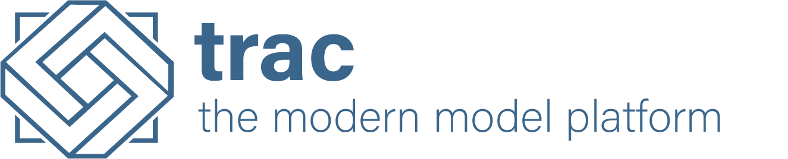

# 

*The modern model platform for complex, critical models and calculations.*

TRAC is a universal model orchestration solution for managing the most complex, critical
and highly governed workflows. It combines your existing data and compute infrastructure,
model development environments and the repository of versioned code, to create a single ecosystem 
in which to build and deploy models, orchestrate complex workflows and run analytics.

TRAC is designed to break the trade-off that has traditionally been required, between flexible 
(but uncontrolled) analytics solutions and highly controlled (but inflexible) production model 
platforms. It offers best of both worlds, power, control and analytical flexibility.

TRAC D.A.P. is the open-source data & analytics toolkit which provides the core capabilities of TRAC.
It is maintained by [finTRAC Limited](https://fintrac.co.uk/)
in association with [FINOS](https://www.finos.org/)
and is available to download and use for free under the
[Apache License, Version 2.0](https://www.apache.org/licenses/LICENSE-2.0>).

## Documentation and Packages

Documentation for TRAC D.A.P. is available at [tracdap.finos.org](https://tracdap.finos.org).

The following packages are available:

| Package                                                                  | Description                                                                                           |
|--------------------------------------------------------------------------|-------------------------------------------------------------------------------------------------------|
| [Model runtime for Python](https://pypi.org/project/tracdap-runtime/)    | Build models and test them in a sandbox, ready to deploy to the platform                              |
| [Web API package](https://www.npmjs.com/package/@finos/tracdap-web-api)  | Build client apps in JavaScript or TypeScript using the TRAC platform APIs                            |
| [Platform releases](https://github.com/finos/tracdap/releases)           | Packages for the platform services and a standalone sandbox are published with each release on GitHub |

Commercially supported deployments of TRAC are available separately from [finTRAC Limited](https://www.fintrac.co.uk).

## Development Status

The current release series (0.7) contains the core capabilities needed to build and run models,
both for local development and in a hosted environment. It also contains the platform services
and APIs needed to build client applications and system-to-system integrations.

Metadata compatibility is guaranteed within each release series (e.g. 0.7.x). Minor changes may
occur between release series, mostly for internal structures and removal of deprecated APIs.
The metadata model will be frozen at version 1.0 after which it may be added to but no fields
will be removed or change. Configuration formats are subject to change between versions and
extension (plugin) APIs should be considered internal for the time being.

For more information see the
[development roadmap](https://github.com/finos/tracdap/wiki/Development-Roadmap).

## Building models

With TRAC D.A.P. you can build and run production-ready models right on your desktop!
All you need is an IDE, Python  and the tracdap-runtime Python package.
TRAC D.A.P. requires Python 3.8 or later.

The [modelling tutorial](https://tracdap.finos.org/en/stable/modelling/tutorial/hello_world.html)
shows you how to get set up and write your first models. You can write models locally using
an IDE or notebook, once the model is working t can be loaded to the platform without modification.
TRAC D.A.P. will validate the model and ensure it behaves the same on-platform as it does locally.
Of course, the production platform will allow for significantly greater data volumes and compute power!

A full listing of the modelling API is available in the
[model API reference](https://tracdap.finos.org/en/stable/autoapi/tracdap/rt/index.html).

## Running the platform

TRAC D.A.P. is designed for easy installation in complex and controlled enterprise environments.
The tracdap-platform package is available with each release on our
[release page](https://github.com/finos/tracdap/releases) and includes a pre-built distribution
of each  of the platform services and supporting tools, suitable for deploying in a container
or on physical or virtual infrastructure. All the packages are platform-agnostic. 

A sandbox version of the platform is also available for quick setup in development, testing and demo
scenarios. The tracdap-sandbox package is available with each release on our
[release page](https://github.com/finos/tracdap/releases) and instructions are available in the
[sandbox quick start guide](https://tracdap.finos.org/en/stable/deployment/sandbox.html)
in our documentation.

## Development

We have used the excellent tools from [JetBrains](https://www.jetbrains.com) to build TRAC D.A.P.
After you fork and clone the repository you can open the project in IntelliJ IDEA and use the script
dev/ide/copy_settings.sh (Linux/macOS) or dev\ide\copy_settings.bat (Windows) to set up some helpful IDE
config, including modules for the non-Java components, run configurations, license templates etc. 
If you prefer another IDE that is also fine, you may wish to set up a similar set of config in which case
we would welcome a PR.

If you need help getting set up to develop features for TRAC D.A.P., please
[get in touch](https://github.com/finos/tracdap/issues)!

## Contributing

1. Fork it (<https://github.com/finos/tracdap/fork>)
2. Create your feature branch (`git checkout -b feature/fooBar`)
3. Read our [contribution guidelines](./CONTRIBUTING.md) and [Community Code of Conduct](https://www.finos.org/code-of-conduct)
4. Commit your changes (`git commit -am 'Add some fooBar'`)
5. Push to the branch (`git push origin feature/fooBar`)
6. Create a new Pull Request

_NOTE:_ Commits and pull requests to FINOS repositories will only be accepted from those contributors with
an active, executed Individual Contributor License Agreement (ICLA) with FINOS OR who are covered under an
existing and active Corporate Contribution License Agreement (CCLA) executed with FINOS. Commits from
individuals not covered under an ICLA or CCLA will be flagged and blocked by the FINOS Clabot tool
(or [EasyCLA](https://community.finos.org/docs/governance/Software-Projects/easycla)). Please note that
some CCLAs require individuals/employees to be explicitly named on the CCLA.

*Need an ICLA? Unsure if you are covered under an existing CCLA? Email [help@finos.org](mailto:help@finos.org)*

## License

This product is maintained by finTRAC (https://fintrac.co.uk/) in association with
the Fintech Open Source Foundation (https://www.finos.org/) and distributed under the terms of
the [Apache License, Version 2.0](http://www.apache.org/licenses/LICENSE-2.0).

SPDX-License-Identifier: [Apache-2.0](https://spdx.org/licenses/Apache-2.0)

For more information including copyright history, see the [NOTICE](./NOTICE) file.
