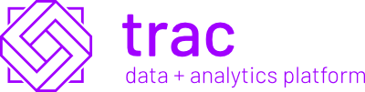

# 

*A next-generation data and analytics platform for use in highly regulated environments*

TRAC D.A.P. brings a step change in performance, insight, flexibility and control 
compared to conventional analytics platforms. By redrawing the boundary
between business and technology, modellers and business users are given easy
access to modern, open source tools that can execute at scale, while technology
integrations and operational concerns are cleanly separated and consolidated
across use cases.

At the core of a platform, a flexible metadata model allows data and models to
be catalogued, plugged together and shared across the business. Using the
principal of immutability, TRAC allows new data structures and model pipelines
to be created, updated and executed at any time without change risk to production
workflows, guaranteeing total repeatability, audit and control (TRAC).

## Documentation and Packages

Documentation for the TRAC platform is available on our website at
[tracdap.finos.org](https://tracdap.finos.org).

The following packages are available:

| Package                                                                  | Description                                                                                           |
|--------------------------------------------------------------------------|-------------------------------------------------------------------------------------------------------|
| [Model runtime for Python](https://pypi.org/project/tracdap-runtime/)    | Build models and test them in a sandbox, ready to deploy to the platform                              |
| [Web API package](https://www.npmjs.com/package/@finos/tracdap-web-api)  | Build client apps in JavaScript or TypeScript using the TRAC platform APIs                            |
| [Platform releases](https://github.com/finos/tracdap/releases)           | Packages for the platform services and a standalone sandbox are published with each release on GitHub |

## Development Status

The current release series (0.4.x) is intended for model development and prototyping.
It provides an end-to-end workflow to build and run individual models in a local
environment. It also provides the platform APIs needed to build client applications
such as web tools or system client system integrations.

The TRAC metadata structures and API calls are mostly complete. Metadata compatibility
is ensured within a release series starting from version 0.4.0 - the 0.4.x series
will be compatible with 0.4.0 but changes may be introduced in 0.5.0. The metadata
model will continue to stabilise before eventually being frozen for version 1.0.0,
after which it may be added to but no fields will be removed or changed.

For more information see the
[development roadmap](https://github.com/finos/tracdap/wiki/Development-Roadmap).

## Building models

TODO

## Running the TRAC platform

TODO

## Development

TODO

## Contributing

1. Fork it (<https://github.com/finos/tracdap/fork>)
2. Create your feature branch (`git checkout -b feature/fooBar`)
3. Read our [contribution guidelines](./CONTRIBUTING.md) and [Community Code of Conduct](https://www.finos.org/code-of-conduct)
4. Commit your changes (`git commit -am 'Add some fooBar'`)
5. Push to the branch (`git push origin feature/fooBar`)
6. Create a new Pull Request

_NOTE:_ Commits and pull requests to FINOS repositories will only be accepted from those contributors with an active, executed Individual Contributor License Agreement (ICLA) with FINOS OR who are covered under an existing and active Corporate Contribution License Agreement (CCLA) executed with FINOS. Commits from individuals not covered under an ICLA or CCLA will be flagged and blocked by the FINOS Clabot tool (or [EasyCLA](https://community.finos.org/docs/governance/Software-Projects/easycla)). Please note that some CCLAs require individuals/employees to be explicitly named on the CCLA.

*Need an ICLA? Unsure if you are covered under an existing CCLA? Email [help@finos.org](mailto:help@finos.org)*

## License

Copyright 2022 Accenture Global Solutions Limited

Distributed under the [Apache License, Version 2.0](http://www.apache.org/licenses/LICENSE-2.0).

SPDX-License-Identifier: [Apache-2.0](https://spdx.org/licenses/Apache-2.0)
