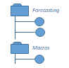

Metadata Model
==============

TODO metadata intro

For a ful listing of all the data structures in the metadata model, refer to the
:doc:`metadata listing <./autoapi/trac/metadata/index>`.

Objects
-------

The four most common types of object show how a calculation run is expressed on the TRAC platform.

.. list-table::
    :header-rows: 1
    :widths: 66 66 200 200 200

    * -
      -
      - Metadata
      - Resource
      - Immutability

    * - **DATA**
      - |icon-data|
      - Structural representation of the data schema, plus its physical storage location
      - Reference to a physical data location [#extref]_
      - Physical datasets can be appended but never updated

    * - **MODEL**
      - |icon-model|
      - A model schema, describing the inputs, outputs and parameters of a model
      - Reference to immutable model code or a binary package (e.g. in Git or Nexus) [#extref]_
      - The model repository guarantees immutability of each model version,
        multiple versions can be imported

    * - **FLOW**
      - |icon-flow|
      - Structural representation of the data schema, plus its physical storage location
      - N/A
      - Metadata is always immutable

    * - **JOB**
      - |icon-job|
      - Structural representation of the data schema, plus its physical storage location
      - N/A
      - Metadata is always immutable

.. [#extref]
    *References to physical locations are not stored directly in the metadata.
    Instead the metadata refers to location keys which are described in the platform configuration,
    so resource locations can be moved when the platform is migrated or re-deployed.*

.. |icon-data| image:: _images/icon-data.png
   :width: 66px
   :height: 66px

.. |icon-flow| image:: _images/icon-flow.png
   :width: 66px
   :height: 66px

.. seealso::
    :class:`ObjectType <trac.metadata.ObjectType>`,
    :class:`ObjectDefinition <trac.metadata.ObjectDefinition>`

.. rst-class:: html-toggle

More object types
~~~~~~~~~~~~~~~~~

.. list-table::
    :header-rows: 1
    :widths: 66 66 600

    * -
      -
      - Metadata

    * - **FILE**
      - |icon-file|
      - Structural representation of the data schema, plus its physical storage location

    * - **CUSTOM**
      - |icon-custom|
      - A model schema, describing the inputs, outputs and parameters of a model

    * - **STORAGE**
      - |icon-storage|
      - Structural representation of the data schema, plus its physical storage location

.. |icon-file| image:: _images/icon-file.png
   :width: 66px
   :height: 66px

.. |icon-custom| image:: _images/icon-custom.png
   :width: 66px
   :height: 66px

.. |icon-storage| image:: _images/icon-storage.png
   :width: 66px
   :height: 66px

Tags
----

TODO

.. seealso::
    :class:`Tag <trac.metadata.Tag>`

Versioning
----------

TODO

.. seealso::
    :class:`TagHeader <trac.metadata.TagHeader>`

Selectors
---------

TODO

.. seealso::
    :class:`TagSelector <trac.metadata.TagSelector>`

Queries
-------

TODO

.. seealso::
    :class:`SearchParameters <trac.metadata.SearchParameters>`
