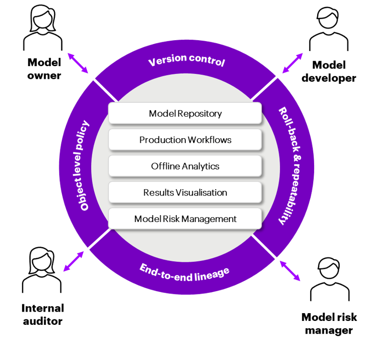

Introduction to TRAC
====================

TRAC is a new type of analytics solution designed to work with cloud and big data technologies
to solve the challenge of managing complex and highly governed models across their lifecycle
for multiple personas.

.. panels::
    :column: col-lg-6 col-md-12 col-sm-12 col-xs-12 p-2 border-0
    :header: text-center pt-0 pb-1
    :body: text-left pt-0 pb-0

    **What is TRAC?**
    ^^^^^^^^^^^^^^^^^

    * A model management and orchestration solution which is;
    * Built around a structural meta-data model
    * Designed to manage complex, critical, highly governed models
    * Open source and free of any licence costs
    * Compatible with all major cloud providers and Hadoop

    ---

    **What is different about TRAC?**
    ^^^^^^^^^^^^^^^^^^^^^^^^^^^^^^^^^

    * Integrates the model inventory, code repository and model execution
    * Systemizes the model execution process, including overlays and sign-off
    * Comprehensive version history and audit trail (BCBS239, SoX)
    * Perfect roll-back and repeatability of any historical calculation
    * Easy to configure what-if and champion-challenger analysis
    * Flexible system for policy controls and model risk reporting

Structured meta-data model
--------------------------

TRAC is built around a structural metadata model which, combined with the immutability of
the underlying objects, gives users a full version history, lineage, roll-back and repeatability.

The 'No-IT' operating model
---------------------------

TRAC empowers model developers and model users to self-serve within a controlled environment,
eliminating the need for a platform support team to manage configuration and deployments at
the application level.

.. list-table::
    :widths: 30 70 200

    * - |icon-zero-risk|
      - **Zero-risk deployment**
      - TRAC's built-in repeatability guarantee allows new models, data and overlays to
        be loaded and executed against production data at any time, with zero change risk,
        so the traditional separation between user and platform team is redundant.

    * - |icon-self-gen-ui|
      - **Self-generating UI**
      - Models and data loaded onto the platform are immediately available to configure and
        run in the user interface. The meta-data associated with model objects describes their
        parameters and inputs, so the UI can be generated dynamically.

    * - |icon-auto-doc|
      - **Automated documentation**
      - Model implementation, data lineage and audit documentation is automated from the TRAC
        meta-data, eliminating the need for labour-intensive paper production exercises by a
        platform support team.

    * - |icon-ctrl|
      - **User-defined controls**
      - A configurable policy service enforces tagging of production (i.e. signed-off) assets,
        preventing confusion with ad-hoc, experimental or challenger runs. This governs user
        permissions and the allocation of platform resources.

    * - |icon-rtl|
      - **Seamless route to live**
      - In TRAC, everything is always live. The production model is controlled by sign-off policies,
        to enforce constrains and record evidence before applying the “production” tag. The sign-off
        process has full point-in-time history and every version remains available for rollback.

.. |icon-zero-risk| image:: ../_images/icon-zero-risk.png
   :width: 66px
   :height: 66px

Compatibility and deployment
----------------------------

TRAC uses open standards to provide a familiar developer experience and several easy options for integration.

.. panels::
    :column: col-lg-6 col-md-12 col-sm-12 col-xs-12 p-2 border-0
    :header: text-center pt-0 pb-1
    :body: text-left pt-0 pb-0

    **Open standards**
    ^^^^^^^^^^^^^^^^^^

    * **Built on open standards** for maximum compatibility and minimum lock-in
    * **Focus on developer experience** with a “batteries included” philosophy,
      so developers can get going right away
    * **Designed for integration** with complex data landscapes; open standards are best,
      integration with bespoke components is also possible

    ---

    **Deployment options**
    ^^^^^^^^^^^^^^^^^^^^^^

    * **Using established patterns** that your organization already has in place will simplify deployment and maintenance
    * **Cloud and tooling vendors** are willing to produce deployment templates for TRAC on their
      platforms (some already have)!
    * **Common tools** such as Terraform or Ansible can be set up quickly if there is nothing else in place
