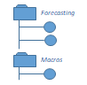

Metadata Model
==============

The TRAC metadata model is a structured data model that records and catalogs every asset and
traceable action [#tracable]_ known to the TRAC platform. It consists of two layers:

    *   Objects are the structural element of the model, they represent assets and actions. Data, models
        and jobs are all described by metadata objects. Each type of object has a metadata structure that is
        defined as part of the TRAC API.

    *   Tags are used to index, describe and control objects, they are made up of key-value attributes.
        Some attributes are controlled by the platform, others can be set by client applications or
        edited by users.

Both objects and tags are versioned with an immutable, time-indexed version history, "updates" are performed
by creating a new version of the object or tag with the required changes. Because of this, the TRAC metadata
provides a fully consistent historical view of the platform for any previous point in time. It also provides
a complete audit history that is both machine and human readable, with no manual effort.

Where objects refer to external resources such as models and data, those resources are also immutable [#mutable]_.
This is achieved using e.g. GitHub tags or Nexus binary versions for models, and data areas owned by TRAC with
controlled write access for primary data. The combination of immutable metadata and immutable resources allows
TRAC to recreate any previous calculation that has run on the platform. As a result, generated and intermediate
data can often be discarded and recreated later if needed.

.. [#tracable]
    *Traceable actions are actions that create assets, such as running jobs or data imports. Read-only
    actions such as querying data or metadata searches are not currently recorded in the TRAC metadata.*

.. [#mutable]
    *TRAC objects can refer to mutable resources, however these cannot be used to build repeatable
    calculation jobs or workflows. Typically mutable objects are used as a source for import jobs.*

.. seealso::
    For a comprehensive reference of data structures in the metadata model, see the
    :doc:`metadata listing <../autoapi/tracdap/metadata/index>`.

Objects
-------

To begin with, let's look at four of the most common types of object. This will be enough to see how a
calculation job is put together and some of the things that are then possible to do with it.

.. list-table::
    :header-rows: 1
    :widths: 66 66 200 200 200

    * -
      -
      - Metadata
      - Resource
      - Immutability

    * - **DATA**
      - |icon-data|
      - Structural representation of the data schema, plus its physical storage location
      - Reference to a physical data location [#extref]_
      - Physical datasets can be appended but never updated

    * - **MODEL**
      - |icon-model|
      - A model schema, describing the inputs, outputs and parameters of a model
      - Reference to immutable model code or a binary package (e.g. in Git or Nexus) [#extref]_
      - The model repository guarantees immutability of each model version,
        multiple versions can be imported

    * - **FLOW**
      - |icon-flow|
      - A graph describing the calculation flow; inputs, outputs and models are nodes, edges represent data flow
      - None, the flow is abstract and does not refer to specific data or models
      - Metadata is always immutable

    * - **JOB**
      - |icon-job|
      - A job maps a target flow to the real datasets, models and parameters that will be used to execute it
      - None, jobs refer to other metadata objects but not directly to external resources
      - Metadata is always immutable

.. [#extref]
    *References to physical locations are not stored directly in the metadata.
    Instead the metadata refers to location keys which are described in the platform configuration,
    so resource locations can be moved when the platform is migrated or re-deployed.*

Putting together a job
""""""""""""""""""""""

To run a job, first the calculation flow is selected from the list of available flows. (We assume that flows
as well as data and models have been created, loaded into the platform and tagged for use). The flow object
describes the inputs and model components that it needs to run and the outputs it will produce.

The second step is to select the data and model objects that will be used for each node in the flow,
as well as any required model parameters. The flow definition can include metadata search expressions
for each required input and model that can be used to find all the relevant objects, set defaults and
present available options in a UI. Of course, sometimes users may want to browse for specific items
to include in the flow which is always possible, however including default search expressions in the
flow definition can hugely simplify setting up common jobs. A similar mechanism is available for setting
up default parameters.

Once all the items that will go into the job have been chosen, the client creates a job definition with
a map of all the requirements for the flow to the TRAC objects that will satisfy them. This job definition
is sent to the TRAC orchestrator service where it is validated and executed. The TRAC platform fetches all
the required resources (data and models) for each run, runs are isolated and stateless so they don't
interfere with each other.

All being well the run succeeds and produces new data objects as results. These data objects
include a reference to the job that created them, so linage can be traced back (lineage covers multiple
hops if those outputs are fed into another stage of processing).

Some useful features
""""""""""""""""""""

    -   **Automatic audit trail** - In TRAC the metadata is the audit trail, it is created automatically
        for every asset and every job that runs on the platform. This provides an audit system that can be
        easily understood by both humans and machines and is fully controlled and searchable.

    -   **Guaranteed repeatability** - All the TRAC metadata and the resources they refer to are immutable,
        so resubmitting an old job definition will create the same results as the original run. Output and
        intermediate data can often be expunged and recreated later if needed (TRAC has a special function
        to recreate expunged outputs automatically).

    -   **Tweak and repeat** - Old jobs can be loaded up into the same tools used to create them originally,
        because the metadata format is the same. They can then be edited and resubmitted with any desired
        changes. Run last year's models with this year's data, or a series of what-if scenarios.
        If the new data and models are not compatible, TRAC will explain exactly what the differences are.

    -   **Parallel runs, parallel versions** - TRAC can execute as many parallel runs as the underlying compute
        infrastructure will allow. Because the runs are isolated and stateless, multiple runs can use different
        versions of the same model or the same dataset at the same time.

    -   **Combine model versions** - It is even possible to load different versions of the same model code within
        a single run. This can be useful to run challenger versions of individual components in a long model
        chain, or if some model components are versioned independently. TRAC handles the complexity of loading
        multiple versions of the same codebase into the executor process.

    -   **Zero change risk** - Nothing is ever destroyed on TRAC because everything is immutable. New models
        and data can be imported and run alongside existing ones without damaging them. The "live" models and
        "official" outputs are designated by tags and changing those tags is restricted by access policies.

The repeatability guarantee
"""""""""""""""""""""""""""

TRAC guarantees that repeating a run with the same inputs and models will always produce the same outputs.
We account for multiple factors that cause non-deterministic model output: threading (don't use it!), random
number generation, time, external calls and dynamic execution (these are disabled), language and library
versions (these are recorded with the metadata).

Of course its still possible for a determined and skilled programmer to write model code that breaks out of
these restrictions and does something non-deterministic. It's also possible that with the passing of time,
some runtime dependencies may break, for example if old versions of languages or libraries are no longer
supported on your infrastructure.

For the most critical data that must always be available, the bulletproof approach is to make sure that
primary copies of your data are retained. However for less critical data it is fine to expunge datasets
and rely on TRAC to recreate them if and when needed. TRAC allows configuration of data retention policies
based on metadata tags to control data retention.

More object types
"""""""""""""""""

.. seealso::

    For a comprehensive reference of metadata objects, see the metadata listings for
    :class:`ObjectType<trac.metadata.ObjectType>` and
    :class:`ObjectDefinition<trac.metadata.ObjectDefinition>`.

Tags
----

:class:`Tags<trac.metadata.Tag>` are the core informational element of TRAC’s metadata model, they are
used to index, describe and control objects. Every object has a tag and each tag refers to a single object,
i.e. there is a one-to-one association.

A tag is made up of:

    * A header that identifies the tag and associated object
    * A set of attributes (key-value pairs)
    * The associated object definition

The object definition may sometimes be omitted, for example search results for metadata queries
do not include the full object definition.

Here is an example of a set of tag attributes to illustrate some ways they can be used::

    # A descriptive field intended for human users.

    display_name: "Customer accounts for March 2020, corrected April 6th"

    # A classification that can be used for searching or indexing.
    # Client applications can also use this to find datasets of a certain
    # type; typically an application will define a set of attributes that are
    # "structural", i.e. the application uses those attributes to decide which
    # objects to present for certain purposes.

    dataset_class: "customer_accounts"

    # Properties of an item can be added as individual attributes so they can
    # be searched and displayed individually. This avoids the anti-pattern of
    # putting multiple attributes into a single name/label field:
    #    customer_accounts_mar20_scotland_commercial_approved

    accounting_date: (DATE) 2020-03-31
    region: "Scotland"
    book: "commercial_property"
    figures_approved: (BOOLEAN) true

    # Attributes can be multi-valued. This can be helpful for applying
    # regulatory classifiers, where multiple classifiers may apply to a
    # single item.

    data_classification: ["confidential", "gdpr_pii", "audited"]

    # TRAC records a number of "controlled" attributes, these are set by the
    # platform and cannot be modified directly through the metadata API.
    # Controlled attributes start with the prefix "trac_".

    trac_create_time: (DATETIME) 2020-04-01 10:37:05
    trac_create_user_id: "jane.doe"
    trac_create_user_name: "Jane Doe"

Tag attributes are created and updated using :class:`TagUpdate<trac.metadata.TagUpdate>` operations.
Tag updates are instructions to add, replace, append (for multi-valued attributes) or delete an attribute.
These instructions can be supplied when an object is created or updated, in which case TRAC will fill
in some attributes automatically (timestamp, sign-off state etc). It is also possible to update tags
without changing the associated object, for example to reclassify a dataset or change a description.

Versioning
----------

Versioning is supported for both objects and tags. For objects, versions are a series of immutable
copies where TRAC guarantees compatibility and continuity between versions. The general principal
for compatibility is that new versions will work in place of old versions (i.e. object versions are
backwards-compatible, but the reverse is not necessarily true) and for continuity is that the object
should describe the same resource. The exact requirements for these rules vary depending on object type.

Of particular interest are data updates. In this case, updates can include (1) adding a delta to a
dataset, (2) providing a new snapshot of a dataset (3) adding a partition or (4) updating a partition
with a new snapshot or delta. A new version of the metadata object is created that refers to the new set
of primary data files, including any that are unchanged from the previous version. For example if a delta
is added, the new data definition would refer to all the files referenced in the previous version, plus
the new delta.

A series of tag versions is assigned to every object version. Let's illustrate this with an example::

    v = 1, t = 1  # Initial creation of an object
                  # Let's say it's a dataset containing customer data for some date T0

    v = 1, t = 2  # Add a tag attribute, extra_attr = "some_value"

    v = 2, t = 1  # Corrections are applied to the data, so a new object version is created
                  # By default the attributes from v=1, t=2 are copied to the new tag

    v = 3, t = 1  # Data is added for a second day T1, in a separate partition

    v = 2, t = 2  # The data for T0 is signed off and the policy service updates the sign-off tag
                  # The tag applies to object version 2, which includes data for T0 with the corrections

Object and tag versions are given numbers as shown here, they are also given timestamps which are
recorded by the system when a new object or tag version is created. Either a version number or a
timestamp can be used to uniquely identify versions for both objects and tags.

Selectors
---------

A :class:`TagSelector <trac.metadata.TagSelector>` refers to a single object ID and identifies a specific
object version and tag version for that object. They are used throughout the TRAC platform whenever an
object is referenced, so it is always possible to specify versions using these selection criteria. The
available criteria are:

    1.  | Select the latest available version
        | - *Variable selector, will return a different result when an object or tag is updated to a new version*

    2.  | Select a fixed version number
        | - *Fixed selector, will always return the same result*

    3.  | Select the version for a previous point in time
        | - *Fixed selector, will always return the same result*

Selectors are used in API calls, for example reading a single object from the metadata API uses a tag selector.
Sending API calls with selectors referring to a previous point in time allows client applications to display a
consistent historical view of the platform.

Selectors are also stored in the metadata model to express links between objects. For example, a job definition
uses tag selectors to identify the inputs and models that will be used to execute the job. In the case of a
job definition, the selectors are always stored as fixed selectors to indicate the precise object versions
used; if the user submits a job requesting the latest version of a model or input, TRAC will convert that
selector to a fixed selector before storing the job definition.

Selectors refer to object and tag versions independently and there is no requirement to use the same selection
criteria for both. A selector for objectVersion = 3 with latestTag = true is perfectly valid, this could be
used for example to check the current sign-off state of a particular version of a model.

Queries
-------

The TRAC metadata can be searched using logical expressions to match against tag attributes. Version
and/or timestamp information can also be included as search parameters. It is not possible to search the
contents of an object definition; any properties of an object that are needed for searching must be set
as tag attributes to make them available for metadata queries.

A search expression is a logical combination of search terms that can be built up as an expression tree.
The logical operators available are AND, OR and NOT. A search term matches an individual attribute using
one of the available search operators.

.. list-table::
    :header-rows: 1
    :widths: 75 500

    *
        - Operator
        - Meaning

    *   - **EQ** ==
        -   | Matches an attribute exactly. The attribute must be present and have the correct type and value.
              If the attribute is multi-valued, EQ will match if any of the values match.
            | *EQ may behave erratically for floating point attributes, using EQ, NE or IN with float values
              is not recommended.*

    *   - **NE** !=
        -   The logical inverse of EQ, matches precisely when EQ does not match. If the search attribute is
            not present, NE will match. If the search attribute is multi-value, NE will match only when none
            of the values match.

    *   - **IN**
        -   attr IN [a, b, c] is equivalent to attr == a OR attr = b OR attr = c. If the attribute is multi-
            valued, IN will match if any of the search values match any of the attribute values.

    *   -
            | **GT** >
            | **GE** >=
            | **LT** <
            | **LE** <=

        -   Ordered comparisons, for ordered data types only. The attribute must be present and the type must
            match the search type (comparing an integer to a float, or a date to a date-time value will not match).
            Ordered comparisons will never match if the search attribute is multi-valued.

By default, only the latest versions of objects and tags are considered in a search. Even if a prior version
of an object or tag version would have matched, that prior version is not considered. There are options in the
search parameters to include prior versions, in which case all matching versions of an object or tag will be
returned.

All searches can optionally be run as-of a previous point in time, which will cause the search to ignore
metadata generated after that time. These searches still have the option to include prior versions if
required. Using this feature allows clients to show a consistent historical view of the platform for
functionality that relies on metadata queries.

For the full API reference on metadata searches, see the reference pages for
:class:`SearchParameters<trac.metadata.SearchParameters>` and
:meth:`TracMetadataApi.search()<trac.api.TracMetadataApi.search>`.
